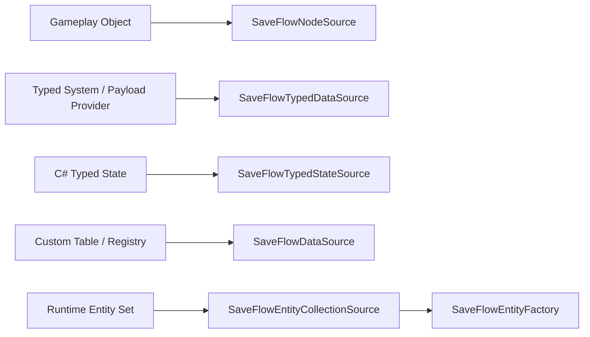
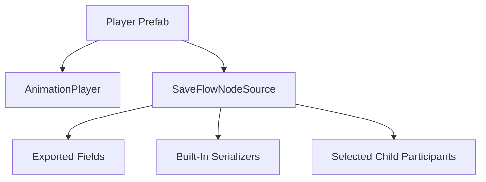
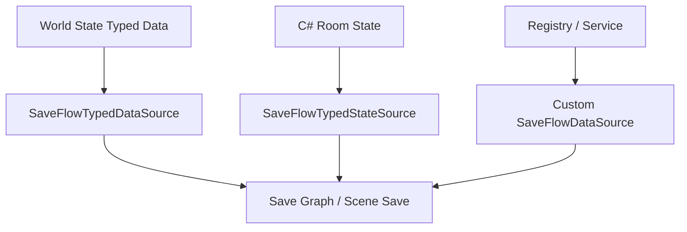
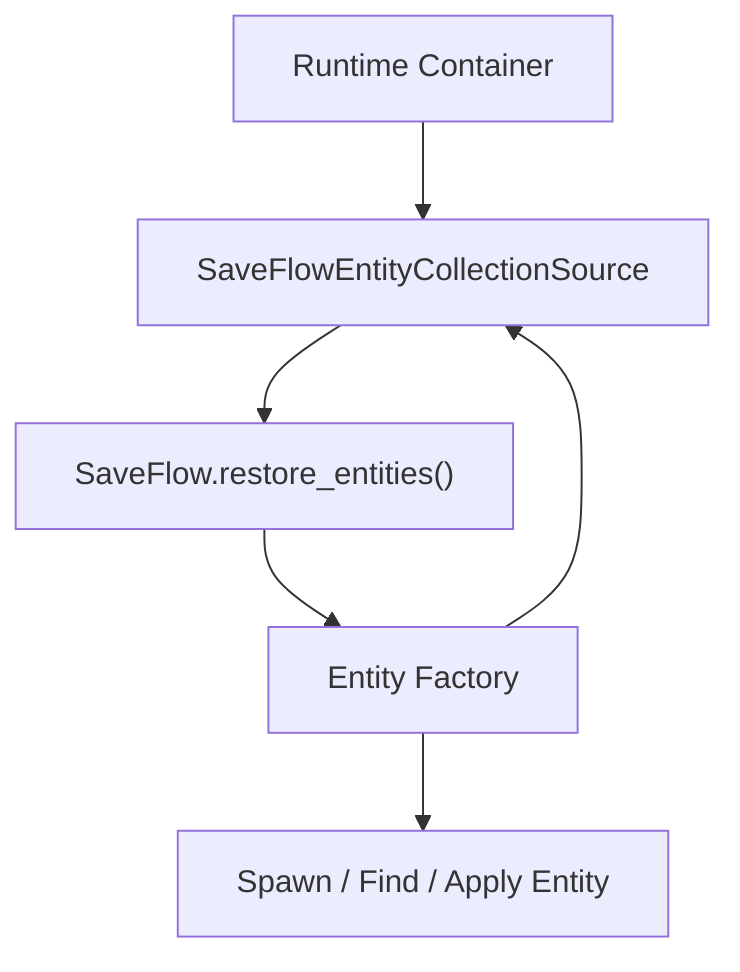
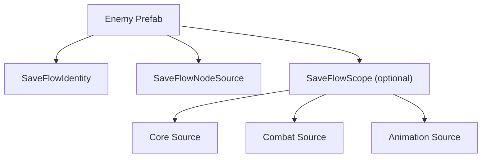
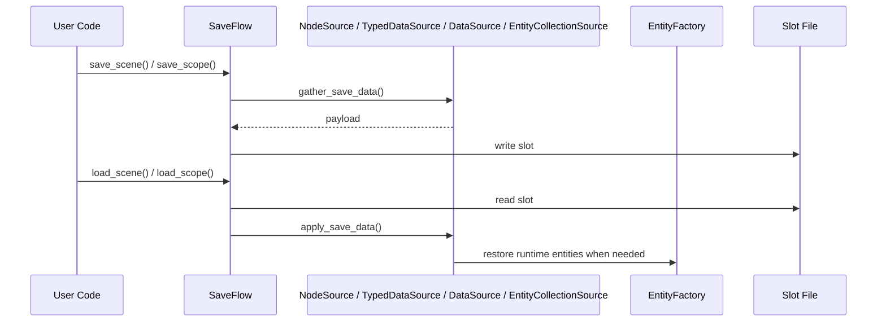

# SaveFlow Concept Map

This document is a fast visual explanation of the current SaveFlow Lite model.

## 1. The three main save paths

Interpretation:
- if the thing is "this object", use `SaveFlowNodeSource`
- if the thing is "this typed system model or payload provider", use `SaveFlowTypedDataSource`
- if the thing is "this C# typed state object", use `SaveFlowTypedStateSource`
- if the thing needs custom table/registry translation, use `SaveFlowDataSource`
- if the thing is "this changing entity set", use `SaveFlowEntityCollectionSource + SaveFlowEntityFactory`

## 2. Node-centric object save

Interpretation:
- `SaveFlowNodeSource` is the main object-facing entry
- one node source can save the object's fields, built-ins, and selected child parts together

## 3. System state save

Interpretation:
- the gameplay system owns the runtime state
- typed data source converts exported fields to save data
- typed state source lets C# DTO state live directly as a save graph source
- custom data source translates runtime state when field persistence is not enough
- the data source plugs directly into SaveFlow

## 4. Entity collection save

Interpretation:
- the collection owns the runtime set
- the entity factory owns project-specific spawn/find/apply logic
- SaveFlow orchestrates restore without taking over the game's factory system

## 5. Runtime entity prefab structure

Interpretation:
- `SaveFlowIdentity` answers "who is this entity?"
- the prefab owns its own save logic
- use a local `SaveFlowScope` only when the entity has composite state

## 6. Save and load flow

Interpretation:
- SaveFlow owns orchestration and file IO
- sources own data gathering / applying
- entity factories own project-specific runtime reconstruction
