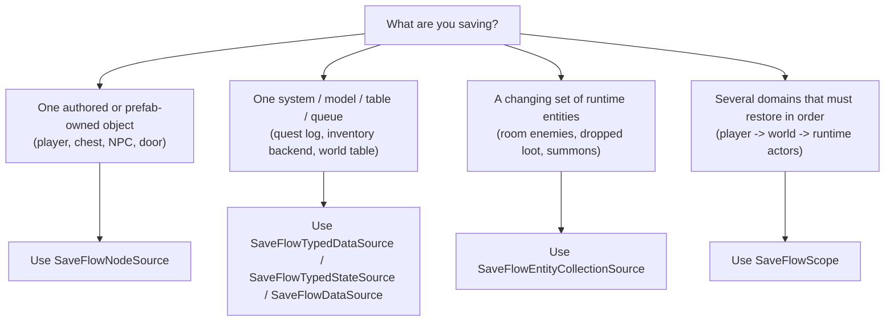
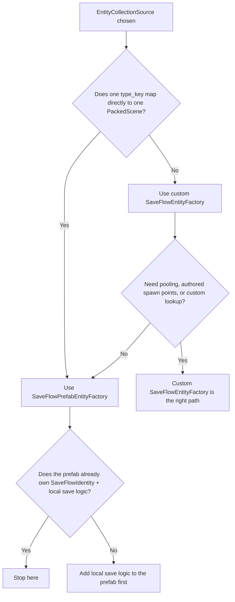

# SaveFlow Quick Selection Map

This guide is the fastest way to choose the right SaveFlow path.

Use it like a decision tree:
- identify what kind of state you are saving
- follow the branch
- stop at the first recommended component that fits

If one gameplay feature contains multiple kinds of state, split them:
- object-owned state -> `SaveFlowNodeSource`
- typed system-owned state -> `SaveFlowTypedDataSource`
- C# typed state -> `SaveFlowTypedStateSource`
- custom system/table adapters -> `SaveFlowDataSource`
- runtime entity sets -> `SaveFlowEntityCollectionSource`
- domain grouping / restore order -> `SaveFlowScope`

## Quick Entry Map



## The Four Main Answers

### 1. `SaveFlowNodeSource`

Choose this when the mental model is:
- save this player
- save this chest
- save this interactable
- save this authored scene object

Common examples:
- player character
- authored chest prefab
- NPC scene instance
- door or switch that lives in the level scene
- UI settings node when it is still just one scene object

Use it when:
- the state naturally belongs to one node or prefab
- exported fields are the main payload
- built-in Godot state such as transform or animation should travel with the object
- selected child nodes conceptually belong to the same object
- if one extra system model is also involved, keep `SaveFlowNodeSource` for the object and add a separate typed data source or custom data source

Do not use it when:
- the real state belongs to a manager, registry, table, queue, or world model
- the save target is actually a runtime entity set

Typical shape:

```text
Player
|- AnimationPlayer
|- SaveFlowNodeSource
```

### 2. `SaveFlowTypedDataSource` / `SaveFlowTypedStateSource` / `SaveFlowDataSource`

Choose this when the mental model is:
- save this quest table
- save this world model
- save this inventory backend
- save this event queue

Common examples:
- quest manager data
- world progression flags
- unlocked codex entries
- inventory model that is not stored on one node
- room mutation table for unloaded areas

Use it when:
- the state does not naturally belong to one scene object
- typed exported fields can represent the model, or you need custom gather/apply code
- the data already lives in a model, manager, or service object
- if you cannot clearly gather and apply one coherent payload, restructure the system first

Do not use it when:
- the thing being saved is still just one gameplay object
- the thing being saved is a runtime entity set

Typical shape:

```text
WorldModel
SaveGraphRoot
|- WorldScope
   |- WorldTypedDataSource
```

Start with `SaveFlowTypedDataSource` when your system state can be expressed as
one payload-provider object. The simplest provider is a `SaveFlowTypedData`
resource:

```gdscript
class_name RoomSaveData
extends SaveFlowTypedData

@export var door_open := false
@export var collected_coins: PackedStringArray = []
```

Use custom `SaveFlowDataSource` when the source must translate a registry,
service, queue, or several runtime structures into one payload.

For C# state that is one DTO/record, start with `SaveFlowTypedStateSource` and
place that C# node directly under the `SaveGraph`:

```text
SaveGraph
|- RoomStateSource (C# script extends SaveFlowTypedStateSource)
```

### 3. `SaveFlowEntityCollectionSource`

Choose this when the mental model is:
- save the enemies in this room
- save the currently spawned loot
- save summoned units
- save temporary runtime actors

Common examples:
- room enemies that can die or respawn
- dropped pickups created at runtime
- summoned companions
- spawned destructibles
- temporary combat actors created by skills

Use it when:
- entities can appear or disappear at runtime
- each entity has identity
- the collection needs restore policy and failure policy

You will always pair it with an entity factory:
- simple case: `SaveFlowPrefabEntityFactory`
- advanced case: custom `SaveFlowEntityFactory`

Factory choice:



Typical shape:

```text
RuntimeActors
EntityFactory
SaveGraphRoot
|- RuntimeScope
   |- EntityCollection
```

### 4. `SaveFlowScope`

Choose this when the mental model is:
- these several save sources belong to one gameplay domain
- these domains must restore in order
- I need domain-level restore behavior

Common examples:
- player domain containing stats, equipment, and party members
- world domain containing quests, progression, and region tables
- runtime domain containing room actors and temporary entities
- settings domain separated from campaign state

Use it for:
- player domain
- world domain
- settings domain
- runtime actors domain
- put `NodeSource`, `DataSource`, and `EntityCollectionSource` inside the right domain instead of forcing one style everywhere

Do not use it as a replacement for object-owned save logic.

Typical shape:

```text
SaveGraphRoot
|- PlayerScope
|  |- PlayerNodeSource
|- WorldScope
|  |- WorldDataSource
|- RuntimeScope
   |- EntityCollection
```

### Choose `SaveFlowPrefabEntityFactory` when:
- one saved `type_key` maps directly to one `PackedScene`
- normal `instantiate()` is enough
- default identity lookup is enough
- the prefab already contains `SaveFlowIdentity` and local save logic

### Choose custom `SaveFlowEntityFactory` when:
- spawning must go through pooling
- spawning must go through authored spawn points
- existing entity lookup comes from a project registry, not container scanning
- payload apply must do more than default local save-graph restore

## Project-Type Cheatsheet

### Small authored game

Use mostly:
- `SaveFlowNodeSource`
- `SaveFlowScope` only if save order starts to matter

### RPG / sim / strategy with many managers

Use mostly:
- `SaveFlowNodeSource` for authored objects
- `SaveFlowDataSource` for quest, inventory, world, progression systems
- `SaveFlowScope` to organize player/world/settings

### Action game with spawned runtime actors

Use mostly:
- `SaveFlowNodeSource` for player and authored objects
- `SaveFlowEntityCollectionSource`
- `SaveFlowPrefabEntityFactory` first
- custom `SaveFlowEntityFactory` only if pooling or custom lookup is real

### Large multi-domain project

Use:
- `SaveFlowScope` as the top-level map of gameplay domains
- inside each scope, choose `NodeSource`, `DataSource`, or `EntityCollectionSource`
- do not force everything into one style

## Wrong Turns To Avoid

- Do not use `SaveFlowScope` when the real answer is still "save this object".
- Do not use `SaveFlowDataSource` just because one node has a few extra fields.
- Do not start with a custom `SaveFlowEntityFactory` if `SaveFlowPrefabEntityFactory` already fits.
- Do not put one giant source on the whole scene tree if the state really belongs to separate domains.
- Do not split one simple object into many save nodes unless restore order or ownership truly demands it.

## Fastest Defaults

If you want the shortest safe answer:

1. One object: use `SaveFlowNodeSource`
2. One manager/model/table: use `SaveFlowDataSource`
3. One runtime entity set: use `SaveFlowEntityCollectionSource + SaveFlowPrefabEntityFactory`
4. Several domains: add `SaveFlowScope`

That is the default SaveFlow Lite path.
